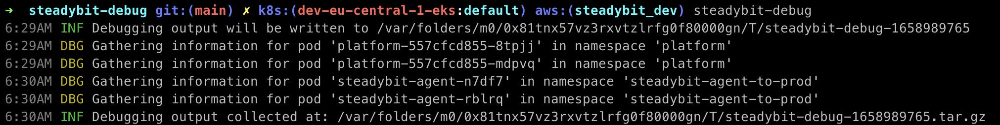

# steadybit-debug

steadybit-debug collects data from installed Steadybit platforms and
agents to aid in customer support. It helps shorten feedback cycles and
avoids frequent back and forth between Steadybit and its customers.

## Prerequisites

- Kubectl needs to be available on the `$PATH` and configured.

## Installation

steadybit-debug is available on Linux, macOS and Windows platforms.

 - Binaries for Linux, Windows and macOS are available as tarballs in the [releases](https://github.com/steadybit/steadybit-debug/releases) page.
 - Via Homebrew for macOS or LinuxBrew for Linux
    ```
    brew tap steadybit/homebrew-steadybit-debug
    brew install steadybit-debug
    ``` 

## Configuration

steadybit-debug has sensible defaults that will work out-of-the-box for
users of our Helm charts that haven't renamed the namespaces, deployments
or daemon sets. If you made changes, you could configure steadybit-debug
to support your specific setup.

Configuration is supported through a file called `steadybit-debug.yml`
existing within your current working directory. You may alternatively
use command line arguments. Refer to `steadybit-debug --help` for more
information.

```yaml
platform:
  namespace: chaos-eng
  deployment: platform
agent:
  namespace: chaos-eng
```

To learn more about all the available configuration options please inspect
the Go `Config` [struct definition](https://github.com/steadybit/steadybit-debug/blob/main/config/config.go#L11).

## Execution

You execute the tool via `steadybit-debug`. Once executed, you will find that the
command collects debugging information within the current working directory.
Please send the generated .tar.gz file to your Steadybit contacts. An example
with command line arguments looks like this:

```
steadybit-debug --platform-deployment platform \
   --platform-namespace platform \
   --agent-namespace steadybit-agent-to-prod
```



## Collected Information

This tool gathers data from your Kubernetes server and the admin endpoints of
the Steadybit platform and agents. The following listing shows an overview of the
generated files (as of 2022-07-28). Feel free to take a closer look at the data
it collected for your installation!

```
.
├── agent
│   ├── config.yaml
│   ├── description.txt
│   └── pods
│       ├── steadybit-agent-n7df7
│       │   ├── config.yml
│       │   ├── description.txt
│       │   ├── env.yml
│       │   ├── health.yml
│       │   ├── info.yml
│       │   ├── logs.txt
│       │   ├── prometheus_metrics.txt
│       │   ├── threaddump.yml
│       │   └── top.txt
│       └── steadybit-agent-rblrq
│           ├── config.yml
│           ├── description.txt
│           ├── env.yml
│           ├── health.yml
│           ├── info.yml
│           ├── logs.txt
│           ├── prometheus_metrics.txt
│           ├── threaddump.yml
│           └── top.txt
├── debugging_config.yaml
└── platform
    ├── config.yaml
    ├── description.txt
    └── pods
        ├── platform-557cfcd855-8tpjj
        │   ├── config.yml
        │   ├── description.txt
        │   ├── env.yml
        │   ├── health.yml
        │   ├── info.yml
        │   ├── logs.txt
        │   ├── prometheus_metrics.txt
        │   ├── threaddump.yml
        │   └── top.txt
        └── platform-557cfcd855-mdpvq
            ├── config.yml
            ├── description.txt
            ├── env.yml
            ├── health.yml
            ├── info.yml
            ├── logs.txt
            ├── prometheus_metrics.txt
            ├── threaddump.yml
            └── top.txt

8 directories, 41 files

```